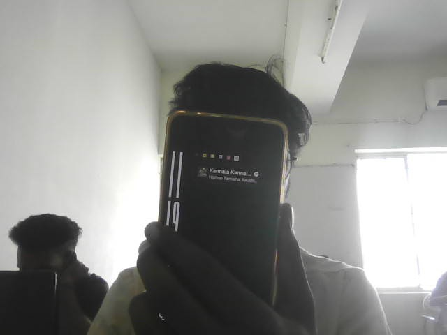
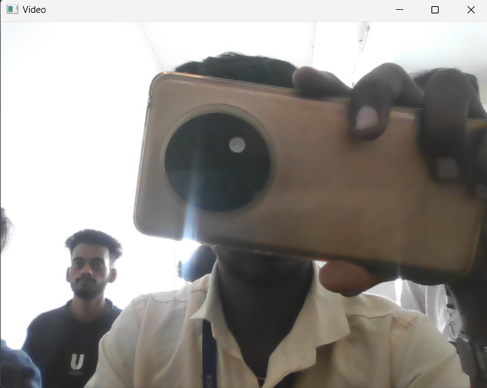

# Image Acquisition using Web Camera
Name : GURUMURTHY S<BR/>
Register No : 212223230066
## Aim:
 
To write a python program using OpenCV to capture the image from the web camera and do the following image manipulations.
i) Write the frame as JPG 
ii) Display the video 
iii) Display the video by resizing the window
iv) Rotate and display the video

## Software Used
Anaconda - Python 3.7
## Algorithm
### Step 1:
<br>Use cv2.VideoCapture(0) to access web camera

### Step 2:
<br>Use cv2.imread to read the video or image


### Step 3:
<br>Use cv2.imwrite to save the image


### Step 4:
<br>Use cv2.imshow to show the video


### Step 5:
<br>End the program and close the output video window by pressing 'q'.


## Program:
``` Python
### Developed By:GURUMURThY S
### Register No:212223230066


## i) Write the frame as JPG file

import cv2 
cap = cv2.VideoCapture (0) 
frame_number = 0 # Initialize frame number 
while frame_number < 5: 
    ret, frame = cap.read() 
    cv2.imshow('frame', frame) 
    # Save frame as JPG file 
    cv2.imwrite(f"frame_{frame_number}.jpg", frame) 
    frame_number += 1 
    if cv2.waitKey(1) & 0xFF == ord('q'): 
        break 
cap.release() 
cv2.destroyAllWindows()


## ii) Display the video

import cv2 
cap = cv2.VideoCapture (0) 
while True: 
    ret, frame = cap.read() 
    cv2.imshow('Video', frame) 
    if cv2.waitKey(1) & 0xFF == ord('q'): 
        break 
cap.release() 
cv2.destroyAllWindows() 


## iii) Display the video by resizing the window
cap = cv2.VideoCapture(0) 
# Create a resizable window 
cv2.namedWindow('Video', cv2.WINDOW_NORMAL) 
while True: 
    ret, frame = cap.read() 
    cv2.imshow('Video', frame) 
    # Resize the window 
    cv2.resizeWindow('Video', 100, 200) 
    if cv2.waitKey(1) & 0xFF == ord('q'): 
        break 
cap.release() 
cv2.destroyAllWindows()


## iv) Rotate and display the video

# import cv2 
cap = cv2.VideoCapture (0) 
# Define the rotation angle (in degrees) 
rotation_angle = 90 
while True: 
    ret, frame = cap.read() 
    # Rotate the frame 
    rotated_frame = cv2.rotate(frame, cv2.ROTATE_90_CLOCKWISE) 
    cv2.imshow('Rotated Video', rotated_frame) 
    if cv2.waitKey(1) & 0xFF == ord('q'): 
        break 
cap.release() 
cv2.destroyAllWindows()

```
## Output

### i) Write the frame as JPG image




### ii) Display the video



### iii) Display the video by resizing the window


### iv) Rotate and display the video


## Result:
Thus the image is accessed from webcamera and displayed using openCV.
